# Gestor Aules GVA – Escales i Outcomes


En aquest repositori trobaràs el Gestor Aules GVA, una eina gràfica que facilita la importació massiva de resultats d’aprenentatge i criteris als cursos Moodle d’Aules GVA —o a qualsevol altra plataforma basada en Moodle. 

A Aules GVA, els outcomes són la manera d’avaluar competències específiques o resultats d’aprenentatge (RA) mitjançant criteris. Com que el sistema de competències natiu de Moodle és un altre món i els administradors el tenen desactivat, fem servir els "resultats" (outcomes) amb este propòsit.

El plantejament és senzill: convertim els resultats d’Aules en criteris específics i els fiquem dins de categories que representen les Competències Específiques (CE) o els Resultats d’Aprenentatge (RA). D’esta manera, podem avaluar igual de bé tant per competències específiques (ESO/BAT) com per RA (FP).

## 📚 Com funciona??

Has de tindre a mà la web del Moodle/Aules, l’ID del curs, el teu usuari i contrasenya, i els teus RA o CE en un fitxer JSON.
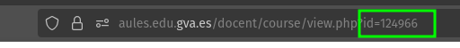
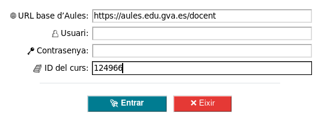


 L’eina els importarà a Aules automàticament, crearà les categories automàticament i es pretenia que assignara els criteris amb els seus pesos corresponents però en Moodle els pesos no s'apliquen directament a les categories. El pes es configura al càlcul total de la categoria pare. Així que, per a que els pesos tinguen efecte, cal configurar l'agregació de la categoria pare com a "Mitjana ponderada de les qualificacions". Això permetrà que els pesos dels criteris dins de cada RA o CE es respecten en el càlcul global.
 
 >No he pogut automatitzar aquest pas des de l'eina, així que hauràs de fer-ho manualment després d'importar els outcomes.

### 📥 Exemple de fitxer JSON

Ací pots descarregar un exemple complet de fitxer JSON amb RA i CE preparat per utilitzar:

**[📄 Descarrega exemple_outcomes.json](./data/example_outcomes.json)**
```json
{
  "resultados": [
    {
      "nombre": "RA1: Selecciona los criterios que configuran las redes para la transmisión de voz y datos, describiendo sus principales características y funcionalidad.",
      "peso": 15,
      "criterios": [
        { "nombre": "RA1.a: ...", "peso": 17 },
        { "nombre": "RA1.b: ...", "peso": 17 },
        { "nombre": "RA1.c: ...", "peso": 17 },
        { "nombre": "RA1.d: ...", "peso": 17 },
        { "nombre": "RA1.e: ...", "peso": 16 },
        { "nombre": "RA1.f: ...", "peso": 16 }
      ]
    }
  ]
}
```
### ⚠️ Abans d’importar: crea o selecciona una escala
També necessites una escala d’avaluació pera assignar-la quan es crea el criteri a Aules. Aquesta cal esollir-la entre les que té Aules o crear-la prèviament de manera manual, perquè per a crear escales a nivell global s’ha de ser administrador (i, almenys a mi, Aules no m’ha deixat fer-ho automàticament). 

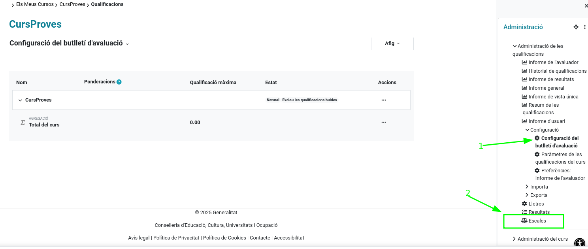
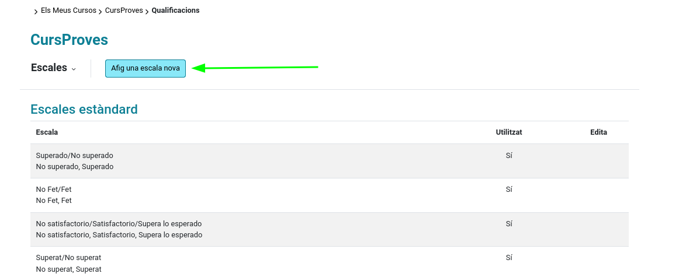
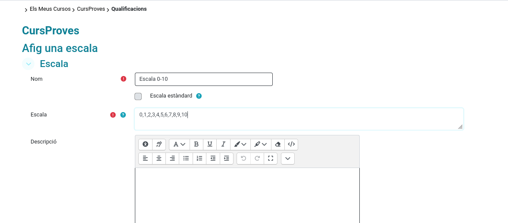


Si utilitzes un Moodle diferent, l’eina també pot importar escales des de fitxers CSV sempre que tingues permisos d’administració.
Format esperat: capçalera i camps
- Capçalera: name,scale,description,standard
- Separador: coma , (si tens ; assegura’t de convertir-lo abans d’importar)
- Exemple:
```csv
name,scale,description,standard
"Superado/No superado","No superado, Superado","Escala binaria en castellano",1
"No Fet/Fet","No Fet, Fet","Escala binària en valencià",1
```
Notes:
- standard: 1 per a fer-la disponible, 0 per a mantenir-la com a no estàndard.
- Pots importar un CSV amb moltes escales seguint este mateix format.

> Recorda que les escales són globals per a tot el Moodle/Aules —excepte les que crees manualment dins d’un curs, que només s’apliquen allí. Per això és important identificar amb exactitud quina escala vols utilitzar abans d’importar els outcomes. 

### 📥 Importa els teus RA i CE
L’app comprova si els RA o CE ja existeixen i no els duplica. També revisa que els pesos dels criteris dins de cada RA sumen 100% (encara que no val per a res ja que caldrà ajustar-los més tard), i crea automàticament les categories per a cada resultat. Tingues present que el que importes realment són els criteris dins de cada RA o CE, no els RA o CE en si mateixos.
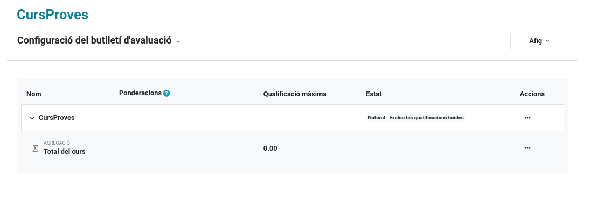
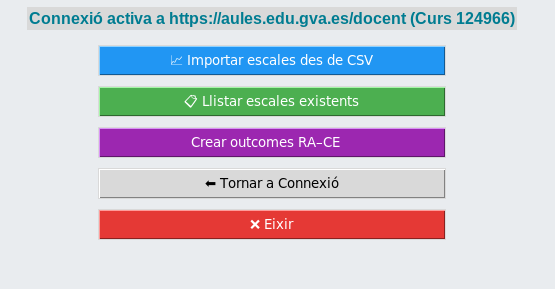
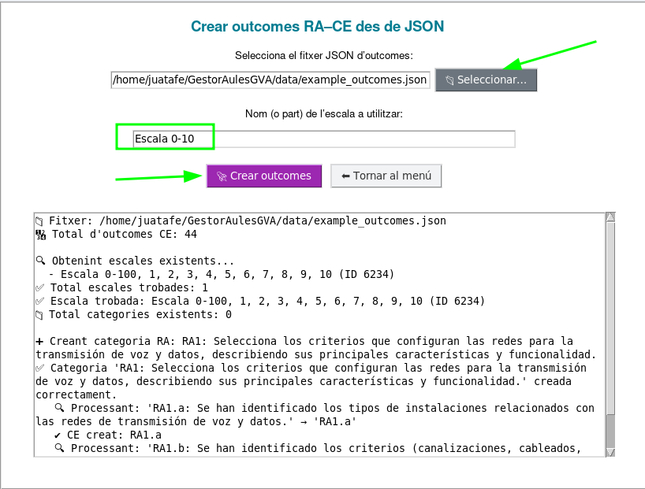

## 👀 Visibilitat al llibre i en les tasques

Una volta importat tot, al llibre de qualificacions veuràs les categories, i conforme vages creant tasques i assignant-los criteris, aquests apareixeran automàticament al llibre i s’utilitzaran per a calcular les notes segons el seu pes i escala. Això et permet avaluar per competències específiques o per RA d’una manera molt més coherent i senzilla.

- Les categories que crees (RA/Competències) apareixen al llibre de qualificacions.
- Quan crees una tasca i li assignes un resultat (criteri), aquest també apareixerà al llibre i s’usarà en el càlcul segons el seu pes i escala.
- Recomanat: utilitzar “Mitjana ponderada de les qualificacions” com a agregació en categories per aprofitar els pesos.

> No es pot automatitzar l'assignació dels criteris a les categories així que hauràs de fer-ho manualment movent els criteris a la categoria corresponent després d'assignar-los a les mateixes. Aquesta és una limitació de Moodle que no es pot superar des de l'eina donat que primer cal crear el criteri i després assignar-lo a la tasca per a que aparega al llibre de qualificacions.

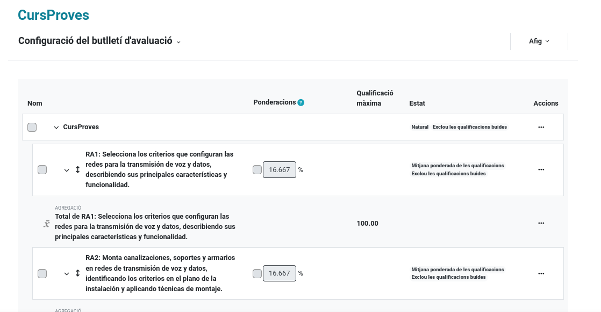
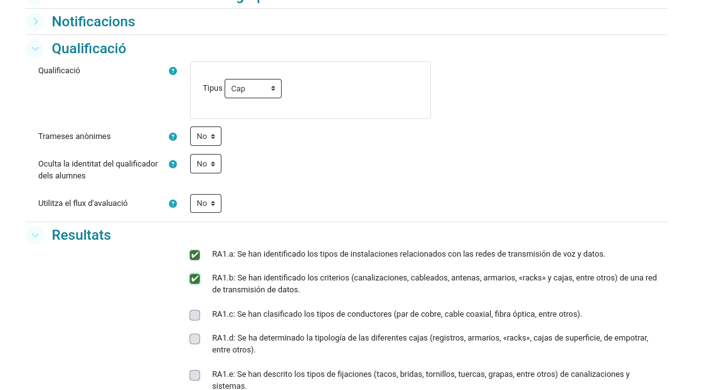
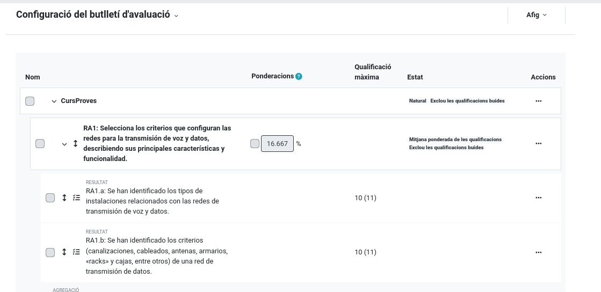

---

## 🎯 Avaluació per competències i RA (Outcomes)

Volem permetre avaluar per competències específiques o per resultats d’aprenentatge (RA). En Aules aquests apareixen com a `Resultats/Resultados/Outcomes`. Cada criteri ponderat es representa com un resultat d’Aules, i es col·loca dins d’una categoria que correspon a la competència específica o al RA, segons treballem a ESO/BAT o FP.

- Al llibre de qualificacions veuràs les categories (CE/RA/Competències) com a carpetes.
- En cada tasca/activitat podràs afegir el criteri a valorar associant l’outcome corresponent.
- La tasca pot tenir la seua pròpia nota, escala o rúbrica, però l’outcome s’utilitzarà per al càlcul global segons el seu pes i escala de forma independent. 
- Per defecte et demana una escala 0–10, però es pot utilitzar qualsevol escala de Moodle/Aules.

> Un bon plugin per a Moodle seria poder assignar directament els criteris d’una rúbrica als outcomes, però això ja és una altra guerra i mereixeria una eina pròpia.
>  De moment, la rúbrica i els criteris poden conviure perfectament en una mateixa tasca: tu valores amb la rúbrica i, a banda, assignes manualment la nota del criteri (outcome). Això permet que l’alumne tinga una nota per a la tasca i una altra per al criteri, cadascuna amb el seu sentit.
> La nota que deuria comptar al llibre de qualificacions serà la del criteri, ponderada segons el seu pes, i no la de la tasca. Això és així perquè no es poden ponderar instruments d’avaluació, ja que aniria en contra del que marca la LOMLOE sobre ponderació dels criteris.
---
## 🛠️ Desenvolupament i contribució

Aquest projecte és de codi obert i està obert a contribucions. Si vols ajudar a millorar-lo, pots fer-ho a través de pull requests o obrint issues amb suggeriments o problemes que trobes. 
Cal destacar que aquest projecte és totalment independent i no està afiliat oficialment amb Aules GVA o la Generalitat Valenciana. 

## 🚀 Origen i Evolució

Aquest projecte naix com una evolució especialitzada del treball de **Martinez Peña i J. García** ([GestiónCalificacionesAules](https://github.com/martinezpenya/GestionCalificacionesAules)), Adaptant-lo a les necessitats específiques de gestió d'outcomes: En vorel el projecte vaig decidir crear aquesta eina més específica per a outcomes i amb una interfície gràfica més amigable. Falta molt per fer, però ja és un bon començament. Cal fer alguna millora per a que pugues copiar pegar del decret i generar el JSON més fàcilment. Borrar categories i criteris també seria interessant, ells si ho implementen però no he pogut trobar la manera d'esborrar massivament outcomes. La diferència principal és que no actue sols contra el llibre de qualificacions sinó que crea criteris perquè automàticament apareguen al llibre de qualificacions quan s'assignen a les tasques. 

---
